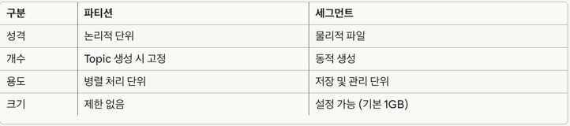
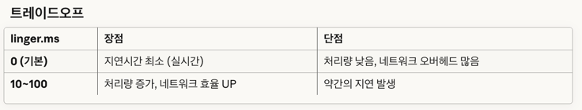

# 6장 카프카 내부 메커니즘
이 장에서는 카프카를 실제로 사용하는 사용자 입장에서 특히 중요한 주제에 초점을 맞출 것이다 
- 카프카 컨트롤러
- 카프카에서 복제가 동작하는 방식
- 카프카가 프로듀서와 컨슈머의 요청을 처리하는 방식
- 카프카가 저장을 처리하는 방식

위 4가지 주제들은 카프카를 튜닝할 때 특히 도움이 된다 <br>
위 부분을 알게되면 아무렇게나 설정을 바꾸는게 아닌, 명확한 의도를 가지고 설정값을 잡아주는 데 큰 도움이 된다 <br>

## 6.1 클러스터 멤버쉽
기존 Zookeeper의 역할을 전담하는 Controller 노드들이 Raft 합의 알고리즘을 통해 메타데이터를 관리하였다 <br>
3개 또는 5개의 Controller 노드로 구성된 Quorum이 형성되며, 이 중 하나가 Active Controller로 선출됩니다 <br>
Controller들은 __cluster_metadata라는 내부 토픽에 모든 메타데이터 변경사항을 이벤트 로그 형태로 기록하였다  <br>

하지만 zookeeper 가 제거되고 현재는 kraft 를 사용하는 버전에서는 다른 식으로 관리를 진행한다 <br>

## 6.2 컨트롤러
컨트롤러는 일반적인 카프카 브로커의 기능에 더해서 파티션 리더를 선출하는 역할을 추가적으로 맡는다 <br>
ex) 브로커01(컨트롤러), 브로커02, 브로커03 <br>

브로커가 컨트롤러가 되면 클러스터 메타데이터 관리와 리더 선출을 시작하기 전에 먼저 최신 레플리카 상태 map 을 읽어온다 <br>

KRaft 이후 부터는 주키퍼 프로세스가 없어졌기에 카프카 프로세스 외에 다른 프로세스는 없다 <br>
다만 카프카 프로세스가 컨트롤러, 브로커 2개 중 하나의 역할을 가지게 된다
- 컨트롤러: 카프카 클러스터의 동적 메타데이터를 저장하는 역할
  - 1개 이상의 프로세스가 하나의 쿼럼을 구성하며, 이들 중에서 저장된 데이터의 업데이트 및 조회 작업을 담당하는 프로세스를 액티브 컨트롤러라고 한다
- 브로커: 카프카 데이터를 저장하는 역할
  - 하나의 컨트롤러 쿼럼을 사용하는 브로커들이 모여 하나의 클러스터를 이룬다.

KRaft 이후의 컨트롤러는 동적 메타데이터를 저장하는 역할을 하는 카프카 프로세스를 가리킨다 <br>

Kafka KRaft에서 Controller Quorum은 메타데이터 관리를 책임지는 Controller 노드들의 그룹이다 <br>
```text
1. 브로커가 "새 토픽 생성" 요청 → Leader Controller에 전달

2. Leader Controller
   - 메타데이터 변경을 로그에 기록
   - Follower Controller들에게 복제 요청

3. Quorum 합의
   - 3개 이상의 Controller가 로그 복제 완료
   - Leader가 "커밋 완료" 선언

4. 모든 브로커에 변경사항 전파
```

1. 고가용성 보장

Controller 1개가 죽어도 나머지가 즉시 새 Leader를 선출합니다 <br>
Zookeeper가 필요했던 이유와 동일하지만, 이제는 Kafka 자체가 해결합니다

2. 데이터 일관성 유지

과반수(Majority)가 동의해야만 메타데이터 변경이 확정됩니다 <br>
5개 노드 중 최소 3개가 동의해야 합니다 (5/2 + 1 = 3)

3. Split-Brain 방지

네트워크 분할 시 과반수를 가진 그룹만 계속 작동합니다 <br>
소수 그룹은 자동으로 서비스를 중단하여 데이터 충돌을 방지합니다

> Controller Quorum = Kafka의 자체 합의 그룹

- Zookeeper 없이도 메타데이터를 안전하게 관리
- Raft 알고리즘으로 Leader 선출 및 로그 복제
- 과반수 합의로 일관성 보장


## 6.3 복제
복제는 카프카 아키텍쳐의 핵심이다 <br>
실제로 카프카는 '분산', '분할', 복제된 커밋 로그 서비스로 표현되기도 한다 <br>
복제가 중요한 이유는 개별적인 노드에 필연적으로 장애가 발생할 수밖에 없는 상황에서 카프카가 신뢰성과 지속성을 보장하는 방식이기 때문이다. <br>

카프카에 저장되는 데이터는 토픽 단위로 해서 조직화 된다 <br>
각 토픽은 1개 이상의 파티션으로 분할되며, 각 파티션은 다시 다수의 레플리카를 가질 수 있다 <br>

각각의 레플리카는 브로커에 저장되는데, 대개 하나의 브로커는 수백 ~ 수천개의 레플리카를 저장한다 <br>

레플리카의 종류는 2가지가 있다
- 리더 레플리카
  - 각 파티션에는 리더 역할을 하는 레플리카가 하나씩 있다.
  - 일관성을 보장하기 위해 모든 쓰기 요청은 리더 레플리카가 진행한다.
- 팔로워 레플리카
  - 리더 레플리카를 제외한 모든 파티션은 팔로워 레플리카 이다.
  - 별도 설정이 없으면 팔로워는 클라이언트 요청을 처리할 수 없다.
  - 이들이 하는 역할은 리더 레플리카로 들어온 메시지를 복제함으로써 최신 상태를 유지하는 것이다.

만약 파티션의 리더 레플리카가 크래쉬가 날 경우, 팔로워 레플리카 중 하나가 파티션의 새 리더 파티션으로 승격된다 <br>

팔로워 레플리카가가 읽기 작업을 하려면 client.rack 컨슈머 설정값을 잡아 주어, 가까운 컨슈머에서 값을 읽게 처리할 수 있다 <br>

리더 역할 레플리카가 수행하는 또 다른 일은 어느 팔로워 레플리카가 리더 레플리카의 최신 상태를 유지하고 있는지 체크하는 것이다 <br>
팔로워 레플리카는 새로운 메시지가 도착하는 즉시 리더 레플리카로부터 모든 메시지를 복제해 옴으로써 최신 상태를 유지할 수 있도록 한다 <br>
하지만 어느 이유에서 동기화가 깨질 수도 있다 <br>

리더 레플리카와의 동기화를 유지하기 위해 팔로워 레플리카들은 리더 레플리카에 읽기 요청을 보낸다 <br>
위 요청은 컨슈머가 메시지를 읽기 위해 사용하는 요청이기도 하다 <br>

- out-of-sync-replica (OSR)
  - 팔로워 레플리카가 리더 레플리카를 따라가는데 실패하였을 경우 -> 장애 상황에서 리더가 될 수 없음
    - 추후 리더를 따라 잡게 되면 ISR 로 복귀 가능함
- in-sync-replica (ISR)
  - 지속적으로 최신 메시지를 요청하고 있는 경우 -> 장애 시 리더가 될 수 있음.

## 6.4 요청 처리
카프카 브로커가 하는 일의 대부분은 클라이언트, 파티션 레플리카, 컨트롤러가 파티션 리더에게 보내는 요청을 처리하는 것이다 <br>
카프카는 TCP로 전달되는 이진 프로토콜을 가지고 있다 <br>

모든 요청은 아래 내용을 포함하는 표준 헤더를 가진다.
- 요청 유형: API Key
- 요청 버전: 브로커는 서로 다른 버전의 클라이언트로부터 요청을 받아 각각의 버전에 맞는 응답을 한다.
- Correlation ID: 각 요청의 고유 식별자 -> 트러블 슈팅에 사용
- 클라이언트 ID: 요청을 보낸 어플리케이션을 식별하기 위해 사용

### 6.4.1 쓰기 요청
acks 설정 매개변수는 쓰기 작업이 성공한 것으로 간주되기 전 메시지에 대한 응답을 보내야 하는 브로커의 수를 가리킨다 <br>
어느 시점에서 메시지가 성공적으로 쓰여졌다 라고 간주되는지는 프로듀서 설정을 통해 바꿀 수 있다
```text
acks=1: 리더만 메시지를 받을 경우
acks=all: 모든 in-sync-replica 들이 메시지를 받았을 때
acks=0: 메시지가 보내졌을 때, 브로커 응답을 기다리지 않음.
```

파티션의 리더 레플리카를 가지고 있는 브로커가 해당 파티션에 대한 쓰기 요청을 받게 되면 몇 가지 유효성 검증을 진행한다
- 데이터를 보내고 있는 사용자가 토픽에 대한 쓰기 권한이 있는지?
- 요청에 지정된 acks 설정값이 올바른지? (0,1,all 만 사용 가능)
- acks=all 일 경우 메시지를 안전하게 쓸 수 있을 만큼, 충분히 in-sync-replica 가 있는지?

그러고 나서 브로커는 새 메시지들은 로컬 디스크에 쓴다 <br>
리눅스의 경우 메시지는 파일 시스템 캐시에 쓰여지는데, 이들이 언제 디스크에 반영될지는 보장이 없다 <br>
카프카는 데이터가 디스크에 저장될 때 까지 기다리지 않는다. 메시지의 지속성을 위해 복제에 의존한다 <br>

메시지가 파티션 리더에 쓰여지고 나면, 브로커는 acks 설정에 따라 응답을 내려보낸다 <br>
0,1 이면 바로 응답을 내려보내고, all 이면 in-sync-replica 에 복제가 된 것을 확인 한 후에 응답을 준다 <br>

### 6.2 읽기 요청
클라이언트는 브로커에 토픽, 파티션 그리고 오프셋 목록에 해당하는 메시지들을 보내 달라는 요청을 보낸다 <br>
ex) test 토픽의 파티션0 오프셋53~60 까지 메시지를 보내주세요 <br>

클라이언트는 각 파티션에 대해 브로커가 리턴할 수 있는 최대 데이터의 양 또한 지정한다 <br>
위 한도가 없을 경우 브로커는 클라이언트가 메모리 부족에 처할 수 있을 정도로 큰 응답을 보낼 수도 있다 <br>

요청은 요청에 지정된 파티션들의 리더를 맡고 있는 브로커에 전송되어야 하며, 클라이언트는 읽기 요청을 정확히 라우팅할 수 있도록 필요한 메타데이터에 대한 요청을 보내게 된다 <br>
요청을 받은 파티션 리더는 먼저 요청이 유효한지를 확인한다 <br>

오프셋이 존재한다면, 브로커는 파티션으로부터 클라이언트가 요청에 지정한 크기 한도만큼의 메시지를 읽어서 클라이언트에게 보내 준다 <br>
카프카는 클라이언트에게 보내는 메시지에 제로카피 최적화를 적용하는 것으로 유명하다 <br>
즉, 메시지를 중간 버퍼를 거치지 않고 바로 네트워크 채널로 보내는 것이다 <br>
위 방법을 통하여 데이터를 복사하고 메모리 상에 버퍼를 관리하기 위한 오버헤드가 사라지며, 결과적으로 성능이 향상된다 <br>

파티션 리더는 어느 메시지가 어느 레플리카로 복제되었는지 알고 있으며, 특정 메시지가 모든 인-싱크 레플리카에 쓰여지기 전까는 컨슈머들이 읽을 수 없다 (acks=all) <br>

충분한 수의 레플리카에 복제가 완료되지 않은 메시지는 '불완전 한' 것으로 간주된다 <br>

-> 읽기 요청은 이해가 다 안돼서 이 부분은 다시 읽고 정리하자!

## 6.5 물리적 저장소
카프카의 기본 저장 단위는 파티션 레플리카 이다 <br>
파티션은 서로 다른 브로커들 사이에 분리될 수 없으며, 같은 브로커의 서로 다른 디스크에 분할 저장되는 것 조차 불가능하다 <br>
따라서 파티션의 크기는 특정 마운트 지점에 사용 가능한 공간에 제한을 받는다고 볼 수 있다 <br>

카프카 설정시 파티션들이 저장될 디렉토리 목록을 정의한다 <br>
log.dirs 매개변수에 지정된다 <br>
카프카가 사용할 각 마운트 지점별로 하나의 디렉토리를 포함하도록 설정하는 것이 일반적이다 <br>

### 6.5.1 계층화된 저장소
- 파티션별로 저장 가능한 데이터에는 한도가 있다. 최대 보존 기한 및 파티션 수는 제품의 요구 조건이 아닌 물리적 디스크 크기에도 제한을 받는다.
- 디스크와 클러스터 크기는 저장소 요구 조건에 의해 결정된다.

계층화된 저장소 기능에서는 카프카 클러스터의 저장소를 로컬과 원격, 두 계층으로 나눈다 <br>
로컬 저장소는 원격 저장소에 비해 지연이 훨씬 짧다 <br>

계층화된 저장소 기능의 이중화된 구조 덕분에 카프카 클러스터의 메모리와 CPU 에 상관없이 저장소를 확장할 수 있다 <br>
계층화된 저장소 기능은 무한한 저장 공간, 더 낮은 비용, 탄력성 뿐만 아니라 오래 된 데이터와 실시간 데이터를 읽는 작업을 분리시키는 기능이 있다 <br>

### 6.5.2 파티션 할당
사용자가 토픽을 생성하면, 카프카는 우선 이 파티션을 브로커 중 하나에 할당한다 <br>
ex) 브로커6개, 파티션10개, 복제 팩터3인 토픽을 생성 <br>
-> 카프카는 30개의 파티션 레플리카를 6개의 브로커에 할당해줘야 한다 <br>

- 레플리카들을 각 브로커에 고르게 분산시킨다.
- 각 파티션에 대해 각각의 레플리카는 서로 다른 브로커에 배치되도록 한다.
- 만약 브로커에 Lack 정보가 있다면, 가능한 각 파티션의 레플리카들을 서로 다른 Lack 에 할당한다.

각 브로커에 '라운드 로빈' 방식으로 파티션을 할당함으로써 리더를 결정한다 <br>

각 파티션과 레플리카에 올바른 브로커를 선택했다면, 새 파티션을 저장할 디렉토리를 결정해야 한다 <br>
위 작업은 파티션별로 독립적으로 수행되며 규칙은 간단하다 <br>

각 디렉토리에 저장되어 있는 파티션 수를 센 뒤, 가장 적은 파티션이 저장된 디렉토리에 새 파티션을 저장하는 것이다 <br>
-> 파티션의 수를 고려해서 저장하지, 기존 디렉토리에 크기는 고려되지 않으므로 이 부분을 조심해야 한다 <br>

### 6.5.3 파일 관리
파티션은 논리적 단위이고, 세그먼트는 물리적 파일 단위이다. <br>
Kafka는 하나의 파티션에 쌓이는 메시지를 하나의 거대한 파일에 저장하지 않고, <br>
여러 개의 작은 세그먼트 파일로 쪼개서 디스크에 저장합니다
기본적인 메시지 관리 세팅은 아래와 같다.
```text
1. 크기 기반 (기본값: 1GB)
log.segment.bytes=1073741824

2. 시간 기반 (기본값: 7일)
log.segment.ms=604800000
```
```text
Topic: test-events (replication-factor=3)
├── Partition 0
│   ├── 00000000000000000000.log  (세그먼트 1) -> 이미 1GB 꽉참
│   ├── 00000000000000123456.log  (세그먼트 2) -> 이미 1GB 꽉참
│   ├── 00000000000000789012.log  (세그먼트 3 - Active)
│   ├── 00000000000000000000.index
├── Partition 1
│   ├── 00000000000000000000.log
│   └── ...
└── Partition 2
    └── ...
```

00000000000000789012 숫자의 의미는 이 세그먼트의 첫 번째 메시지 offset이 789012라는 뜻 <br>
즉, offset 789012부터 다음 세그먼트 시작 전까지의 메시지들이 이 파일에 저장됨 ex) 789012 오프셋 ~ 800000오프셋 까찌 저장되어있다는 뜻<br>

현재 쓰여지는 액티브 세그먼트는 어떠한 경우에도 삭제되지 않는다 <br>



### 6.5.4 파일 형식
각 세그먼트에는 하나의 데이터 파일 형태로 저장된다 <br>
파일 안에는 카프카의 메시지와 오프셋이 저장된다 <br>

디스크에 저장되는 데이터의 형식은 producer 를 통해 브로커로 보내고 consumer 가 읽는 메시지의 형식과 동일하다 <br>
네트워크를 통해 전달되는 형식과 디스크에 저장되는 형식을 통일함으로써 카프카는 컨슈머에 메시지를 전송할 때 제로카피 최적화를 달성한다 <br>
우리가 만약 메시지 형식을 중간에 변경하고자 한다면 네트워크 프로토콜 및 디스크 저장 형식이 모두 변경되어야 한다 <br>

카프카 메시지는 Payload 및 Header 두 부분으로 나누어진다 <br>

카프카 프로듀서는 언제나 메시지를 배치 단위로 전송한다 <br>
만약 하나의 메시지만을 보내고자 할 경우 배치는 약간의 오버헤드를 발생시킨다 <br>
하지만 배치당 2개 이상의 메시지를 보낼 경우, 메시지를 배치 단위로 묶음으로써 공간을 절약하게 되는 만큼 네트워크 대역폭과 디스크 공간을 덜 사용하게 된다 <br>

이것은 카프카가 linger.ms=10 설정을 잡아 주었을 때 더 성능이 좋아지는 이유 중 하나이기도 하다 <br>
linger.ms = "메시지를 모아서 보낼 때까지 기다리는 시간" 이다.
```text
linger.ms = 0 (기본값)
→ 메시지가 도착하면 즉시 전송 (배치 없음)

linger.ms = 10
→ 메시지가 도착해도 10ms 대기
→ 그 사이 추가 메시지가 오면 함께 묶어서 전송
```
```text
// Producer가 메시지를 보낼 때 동작 원리
[메시지 A 도착] 
  ↓
[10ms 대기 중] ← linger.ms = 10
  ↓
[메시지 B, C도 도착]
  ↓
[A, B, C를 한 번에 전송] ← 배치 전송으로 효율 증가
```

 <br>
위 설정을 트레이드 오프는 꼭 기억할 필요가 있다 <br>

카프카가 파티션별로 별도의 배치를 생성하는 만큼, 더 적은 수의 파티션에 쓰는 프로듀서가 더 효율적이다 <br>
카프카 프로듀서가 같은 쓰기 요청에 여러 개의 배치를 포함할 수 있다는 점을 기억하자 <br>


### 6.5.5 인덱스


